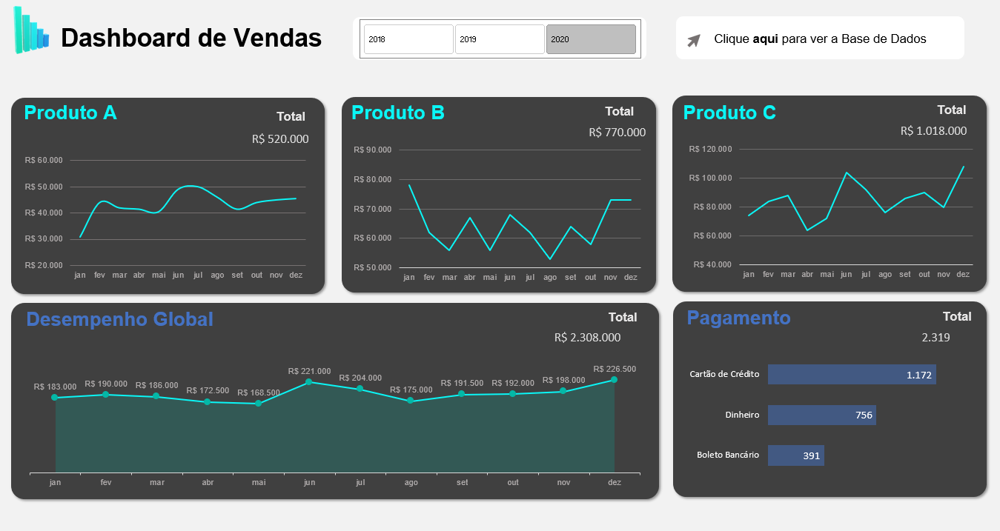

<h1 align="center">
   
  <strong> Relatório de Análise do Dashboard de Vendas (2020) - Projeto Acadêmico</strong>
</h1>

Este relatório é fruto de um projeto acadêmico focado na análise de vendas de 2020, utilizando uma base de dados fictícia. O principal objetivo foi demonstrar o processo de tratamento e visualização de dados para extrair insights estratégicos. Através deste trabalho, aprimorei minhas habilidades em:

*   **Limpeza e Preparação de Dados**: Garantindo a integridade e a usabilidade dos dados brutos.
*   **Criação de Tabelas Dinâmicas**: Para sumarizar e organizar informações complexas de vendas.
*   **Desenvolvimento de Gráficos e Dashboards**: Para criar visualizações claras que facilitam a identificação de padrões e oportunidades.

A compreensão desses dados é fundamental para a tomada de decisões estratégicas e para a otimização do desempenho futuro.

## Visão Geral do Dashboard

  

O dashboard é composto por:

*   **Gráficos de Linha de Vendas por Produto (A, B, C)**: Detalham o desempenho mensal de vendas de cada produto individualmente.
*   **Gráfico de Linha de Desempenho Global**: Apresenta a tendência geral das vendas ao longo do ano.
*   **Gráfico de Barras de Pagamento**: Mostra a distribuição das vendas por método de pagamento.

## Análise Detalhada e Implicações Estratégicas

### Produto A: Análise de Desempenho

O gráfico do Produto A revela um padrão de vendas com flutuações ao longo do ano de 2020. Observa-se um pico notável em fevereiro, seguido por uma queda em março e uma recuperação gradual até junho. Há outro pico em agosto, com uma subsequente diminuição e estabilização no final do ano. O total de vendas para o Produto A foi de R$ 520.000.

**Decisões Estratégicas e Melhorias:**

*   **Investigar Picos de Venda**: É crucial analisar o que impulsionou os picos de vendas em fevereiro e agosto. Isso pode incluir campanhas de marketing específicas, promoções, eventos sazonais ou fatores externos. Compreender esses gatilhos pode permitir a replicação de estratégias bem-sucedidas.
*   **Mitigar Quedas**: As quedas em março e após agosto merecem atenção. A empresa deve investigar as causas, que podem variar de concorrência, problemas de estoque, mudanças nas preferências do consumidor ou fatores econômicos. Estratégias de mitigação podem incluir ofertas especiais, reengajamento de clientes ou ajustes no posicionamento do produto.
*   **Otimização de Estoque**: Com base nos padrões de vendas, é possível otimizar o estoque do Produto A para evitar excessos ou faltas, especialmente antes dos períodos de pico previstos.
*   **Campanhas de Marketing Direcionadas**: Desenvolver campanhas de marketing direcionadas para os meses de menor desempenho pode ajudar a estabilizar as vendas e garantir um fluxo de receita mais consistente ao longo do ano.

### Produto B: Análise de Desempenho

O Produto B apresenta um comportamento de vendas mais volátil em 2020, com um total de R$ 770.000. Houve uma queda acentuada de janeiro a março, seguida por oscilações significativas. Observam-se picos em abril, junho e, mais notavelmente, em novembro e dezembro. A instabilidade sugere que o Produto B pode ser mais sensível a fatores externos ou a campanhas pontuais.

**Decisões Estratégicas e Melhorias:**

*   **Estabilização de Vendas**: A alta volatilidade do Produto B indica a necessidade de estratégias para estabilizar as vendas. Isso pode envolver a criação de demanda contínua através de marketing de conteúdo, programas de fidelidade ou pacotes de produtos.
*   **Análise de Causas de Queda**: As quedas acentuadas, como a de janeiro a março e em agosto, devem ser investigadas. Fatores como a introdução de produtos concorrentes, problemas de qualidade ou feedback negativo de clientes podem estar em jogo. Ações corretivas devem ser implementadas rapidamente.
*   **Capitalizar Picos**: Os picos de vendas em abril, junho, novembro e dezembro devem ser analisados para identificar as condições que os favoreceram. Se foram resultado de promoções, parcerias ou eventos, essas ações podem ser replicadas ou intensificadas em anos futuros.
*   **Diversificação de Canais**: Se as vendas do Produto B dependem muito de um único canal, a diversificação pode reduzir a volatilidade. Explorar novos canais de distribuição ou vendas online pode criar uma base de clientes mais ampla e estável.

### Produto C: Análise de Desempenho

O Produto C foi o de maior faturamento em 2020, com um total de R$ 1.018.000. Seu gráfico de linha mostra um crescimento consistente no início do ano, com um pico significativo em junho, seguido por uma queda e recuperação no segundo semestre, culminando em um forte desempenho em dezembro. A trajetória geral indica um produto com alta demanda e potencial de crescimento.

**Decisões Estratégicas e Melhorias:**

*   **Manter o Impulso**: Dado o alto desempenho do Produto C, a estratégia principal deve ser manter e, se possível, acelerar seu crescimento. Isso pode envolver investimentos contínuos em marketing, desenvolvimento de novas funcionalidades ou variações do produto, e expansão para novos mercados.
*   **Analisar o Pico de Junho**: O pico de vendas em junho é um ponto chave. Entender os fatores que contribuíram para esse sucesso (campanhas de marketing, sazonalidade, eventos específicos) pode ajudar a replicar ou superar esse desempenho em períodos futuros.
*   **Otimização da Cadeia de Suprimentos**: Com a alta demanda, é crucial garantir que a cadeia de suprimentos seja robusta o suficiente para evitar rupturas de estoque, que poderiam resultar em perda de vendas e insatisfação do cliente.
*   **Programas de Fidelidade**: Para um produto de alto desempenho, programas de fidelidade ou ofertas exclusivas para clientes recorrentes podem solidificar a base de consumidores e garantir vendas contínuas.
*   **Feedback do Cliente**: Coletar feedback contínuo dos clientes para o Produto C pode fornecer insights valiosos para melhorias e inovações, mantendo o produto competitivo e relevante.

### Desempenho Global: Tendências e Sazonalidade

O gráfico de Desempenho Global, com um total de R$ 2.308.000 em vendas, oferece uma visão consolidada da performance da empresa ao longo de 2020. Observa-se uma tendência de crescimento nos primeiros meses, com um pico em junho (R$ 221.000), seguido por uma leve queda e recuperação no final do ano, atingindo o maior volume de vendas em dezembro (R$ 226.500). A linha de tendência geral sugere um ano de crescimento, apesar das flutuações mensais.

**Decisões Estratégicas e Melhorias:**

*   **Identificar Fatores de Crescimento**: É fundamental analisar os fatores que contribuíram para o crescimento geral das vendas em 2020, especialmente os picos em junho e dezembro. Isso pode incluir a eficácia de campanhas de marketing, a introdução de novos produtos, a expansão para novos mercados ou eventos sazonais. Compreender esses impulsionadores permite replicar e otimizar estratégias futuras.
*   **Planejamento Sazonal**: O padrão de vendas ao longo do ano indica uma forte sazonalidade, com picos em meados e final do ano. A empresa deve capitalizar esses períodos com planejamento antecipado de estoque, campanhas de marketing intensificadas e alocação de recursos para atender à demanda elevada.
*   **Mitigar Quedas Pós-Pico**: As quedas observadas após os picos de vendas (por exemplo, após junho) devem ser analisadas. Estratégias para suavizar essas quedas podem incluir programas de fidelidade, ofertas pós-venda ou a introdução de produtos complementares para manter o engajamento do cliente.
*   **Análise de Tendências de Longo Prazo**: Embora o gráfico mostre o desempenho de um ano, é importante comparar esses dados com anos anteriores para identificar tendências de longo prazo e projetar o crescimento futuro. Isso pode ajudar a definir metas de vendas mais realistas e a planejar investimentos.
*   **Otimização de Campanhas Contínuas**: Para garantir um fluxo de receita mais estável, a empresa pode investir em campanhas de marketing contínuas e estratégias de retenção de clientes, mesmo fora dos períodos de pico. Isso pode ajudar a reduzir a dependência de eventos sazonais e a construir uma base de clientes mais leal.

### Análise dos Métodos de Pagamento

O gráfico de Pagamento revela a preferência dos clientes pelos diferentes métodos de pagamento, totalizando 2.319 transações. O Cartão de Crédito é o método predominante, com 1.172 transações, seguido por Dinheiro (756 transações) e Boleto Bancário (391 transações).

**Decisões Estratégicas e Melhorias:**

*   **Priorizar Cartão de Crédito**: Dado que o Cartão de Crédito é o método de pagamento mais utilizado, a empresa deve garantir que a experiência de pagamento via cartão seja a mais fluida e segura possível. Isso inclui otimizar o processo de checkout, oferecer opções de parcelamento e garantir a compatibilidade com as principais bandeiras de cartão.
*   **Incentivar Pagamento em Dinheiro**: Embora o Dinheiro seja o segundo método mais popular, a empresa pode explorar maneiras de incentivar seu uso, especialmente em lojas físicas, através de descontos para pagamentos à vista ou programas de fidelidade específicos para essa modalidade.
*   **Avaliar o Boleto Bancário**: O Boleto Bancário é o método menos utilizado. A empresa deve analisar se o custo-benefício de manter essa opção é vantajoso. Se a taxa de conversão for baixa ou os custos operacionais forem altos, pode ser mais eficiente direcionar os esforços para outros métodos de pagamento. No entanto, em mercados onde o boleto é culturalmente relevante, pode ser importante mantê-lo e buscar formas de otimizar seu uso, como lembretes de pagamento ou prazos estendidos.
*   **Explorar Novas Formas de Pagamento**: Com a evolução dos meios de pagamento, a empresa pode considerar a inclusão de novas opções, como carteiras digitais (e.g., Pix, PayPal, Apple Pay, Google Pay) ou criptomoedas, dependendo do perfil do seu público-alvo e do setor de atuação. Isso pode atrair novos clientes e melhorar a conveniência para os existentes.
*   **Análise de Fraudes e Segurança**: Independentemente do método de pagamento, é crucial investir em sistemas robustos de detecção de fraudes e segurança para proteger tanto a empresa quanto os clientes. A confiança no processo de pagamento é um fator chave para a decisão de compra.

## Conclusão e Recomendações Finais

A análise do dashboard de vendas de 2020 revela um cenário dinâmico, com produtos de diferentes perfis de desempenho e tendências sazonais claras. O Produto C se destaca como o principal motor de receita, enquanto o Produto B apresenta maior volatilidade. O Cartão de Crédito é o método de pagamento preferencial dos clientes.

Para otimizar o desempenho futuro, recomenda-se:

1.  **Foco no Produto C**: Continuar investindo no Produto C, explorando novas funcionalidades e mercados para sustentar seu crescimento. Analisar e replicar os fatores de sucesso que levaram ao pico de vendas em junho.
2.  **Estabilização do Produto B**: Desenvolver estratégias para reduzir a volatilidade do Produto B, como campanhas de marketing contínuas e diversificação de canais de venda. Investigar as causas das quedas e implementar ações corretivas.
3.  **Capitalizar a Sazonalidade**: Utilizar os padrões sazonais identificados no Desempenho Global para planejar antecipadamente campanhas de marketing, gestão de estoque e alocação de recursos, especialmente nos períodos de pico (junho e final do ano).
4.  **Otimização dos Métodos de Pagamento**: Garantir uma experiência de pagamento via Cartão de Crédito impecável. Avaliar a relevância do Boleto Bancário e considerar a inclusão de novas formas de pagamento digitais para ampliar as opções dos clientes.
5.  **Análise Contínua**: Implementar um processo de análise contínua dos dados de vendas para identificar rapidamente novas tendências, oportunidades e desafios, permitindo uma tomada de decisão ágil e baseada em dados.
---
### Ao implementar essas recomendações, a empresa estará mais bem preparada para capitalizar suas forças, mitigar suas fraquezas e impulsionar o crescimento sustentável no futuro.
---
🧠 Feito com café ☕ por Naty
